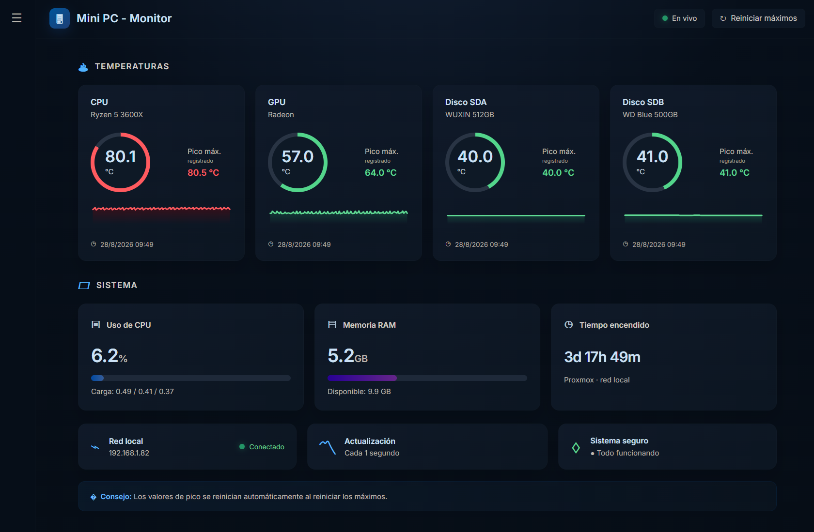

<div align="center">

# 🌡️ Panel de Temperaturas

**Monitor de hardware en tiempo real para cualquier sistema Linux** — temperaturas en vivo, picos máximos, sparklines, alarmas por Telegram y panel de ajustes.

[](https://www.python.org/)
[]()
[](https://poxiitv.github.io/Panel-TEMPERATURAS/)
[]()
[]()

</div>

---

## 🎮 Pruébalo en vivo (DEMO)

<div align="center">

[**🚀 ABRIR LA DEMO**](https://poxiitv.github.io/Panel-TEMPERATURAS/)

*Valores simulados y aleatorios — sin datos reales, sin ajustes.*

</div>

---

## ✨ Ficha rápida

<div align="center">

| | |
|---|---|
| 🌡️ **4 sensores** · CPU · GPU · Disco 1 · Disco 2 | ⏱️ **Actualización** configurable (0.1 s – 5 s) |
| 📈 **Sparkline** en cada tarjeta | 🔺 **Pico máximo** persistente con fecha |
| 🚨 **Alarma Telegram** con seguimiento en vivo | 🛠️ **Panel de ajustes** integrado |
| 🎨 **Colores de umbral** configurables | 💾 **Config persistente** en `config.json` |

</div>

---

## 🧩 Cómo se ve



---

## 🧱 Universal · cómo funciona

> **Funciona en cualquier Linux**, no depende de una distro ni de un hipervisor concreto. Se compone de **un recopilador de sensores** y **un panel web** que se comunican por HTTP:

```
┌───────────────────────────────┐        ┌────────────────────────────────┐
│    SISTEMA / HOST (Linux)     │        │   PANEL / donde lo alojes       │
│                              │  HTTP  │                                │
│  host_server.py   :8686      │◄──────►│  lxc_server.py   :8787         │
│  • lee sensores /sys         │        │  • sirve el panel (index.html) │
│  • sampler 5s en 2º plano    │        │  • proxy a :8686 (GET+POST)    │
│  • picos → peaks.json        │        │  • acceso: http://:8787        │
│  • histórico de temperaturas │        │                                │
│  • config.json (ajustes)     │        │                                │
│  • /api/config + /api/reset  │        │                                │
│                              │        │                                │
│  temp-alarm.service (alarm.py)│       │                                │
│  • vigila CPU, envía Telegram │       │                                │
└───────────────────────────────┘        └────────────────────────────────┘
```

> **¿Por qué dos partes?** En sistemas virtualizados/contenedores, los contenedores (LXC/Docker) **no ven el hardware real** (`/sys/class/hwmon`). El recopilador debe vivir en el **host** (donde están los sensores); el panel web puede ir en el mismo host o en otro sitio.

El código solo usa **librerías estándar de Python** (`http.server`, `urllib`, `json`, `subprocess`) y lee datos del kernel que existen en **cualquier Linux**:
- 🌡️ Temperaturas CPU/GPU → `/sys/class/hwmon`
- 💾 Temperatura de discos → `smartctl` (opcional)
- ⚙️ Uso de CPU/RAM → `/proc`

---

## 📦 Componentes

<div align="center">

| Archivo | Función |
|---|---|
| 🎨 `index.html` | Panel web + ⚙️ pantalla de ajustes |
| 🛰️ `host_server.py` | Recopilador: picos, historial, config |
| 🌐 `lxc_server.py` | Panel-proxy (reenvía GET y POST) |
| 🚨 `alarm.py` | Alarma de temperatura → Telegram |
| ⚙️ `minipc-monitor.service` | Servicio del recopilador |
| ⚙️ `temp-alarm.service` | Servicio de la alarma |

</div>

---

## 🚀 Instalación y configuración

### 1) Recopilador + alarma — en el host Linux

```bash
mkdir -p /opt/monitor
cp host_server.py alarm.py /opt/monitor/
cp minipc-monitor.service temp-alarm.service /etc/systemd/system/

systemctl daemon-reload
systemctl enable --now minipc-monitor temp-alarm
systemctl status minipc-monitor temp-alarm   # → ambos active
```

- Recopilador escucha en `0.0.0.0:8686`.
- Guarda picos en `/opt/monitor/peaks.json` y configuración en `/opt/monitor/config.json`.

> ✏️ Ajusta en `host_server.py`: `DISKS` (tus discos), `SAMPLE_S` (muestreo de picos).

### 2) Panel — el mismo host o aparte

```bash
mkdir -p /opt/minipc-panel
cp lxc_server.py index.html /opt/minipc-panel/
cd /opt/minipc-panel
pm2 start lxc_server.py --name minipc-panel --interpreter python3
pm2 save
```

> ✏️ En `lxc_server.py`: `HOST` (IP del recopilador) y `HTML`.

### 3) Abre el panel

```
http://<ip-del-host-o-panel>:8787
```

---

## 🛠️ Panel de ajustes

Entra en la pestaña **🛠 Ajustes** (barra lateral). Ahí puedes configurar, y se guarda al instante en `config.json`:

- **🌡️ Temperaturas**: umbral verde (≤), umbral amarillo (≤), referencia máxima del gauge.
- **🔄 Actualización**: intervalo del panel (100 ms – 5 s).
- **🚨 Alarma Telegram**: umbral de alarma (°C), segundos de seguimiento, histéresis.
- **🤖 Bot de Telegram**: token del bot + chat ID, con instrucciones y botón **🧪 Probar alarma**.

El botón **💾 Guardar** aplica todo y persiste en `config.json`.

---

## 🔌 API

| Endpoint | Método | Descripción |
|---|---|---|
| `/api/stats` | GET | `current`, `peaks`, `history` |
| `/api/peaks` | GET | Solo picos máximos |
| `/api/reset` | POST | Reinicia picos |
| `/api/config` | GET / POST | Lee / guarda la configuración |
| `/api/test_alarm` | POST | Envía un mensaje de prueba a Telegram |

---

## 🚨 Alarma por Telegram

Cuando la **CPU supera el umbral** (por defecto 95 °C):

```
🚨 ALARMA temperatura
CPU a 96.3 °C (umbral 95 °)
Seguimiento 20 s…
🔴 CPU: 96.1 °C
🔴 CPU: 95.8 °C
🟠 CPU: 94.2 °C
… (cada segundo durante los segundos configurados)
✅ Fin del seguimiento.
```

Tiene **histéresis** (no re-alarma hasta bajar X ° por debajo del umbral).

---

## 🛠️ Requisitos

- 🐍 **Python 3** (solo **stdlib**): `http.server`, `urllib`, `json`, `subprocess`.
- 🐧 **Cualquier Linux** con `smartctl` para temperatura de discos (opcional).
- 🌐 Navegador moderno para el panel.

---

## 🔒 Notas

- El panel es **solo red local** (no lo expongas a Internet).
- `smartctl` se ejecuta cacheado (30 s) para no penalizar el rendimiento.
- Los **picos y la configuración** son **persistentes** en disco (`peaks.json`, `config.json`), sobreviven reinicios, y el botón *Reiniciar máximos* los borra.

---

<div align="center">

Hecho con 💙 para tener tu sistema siempre bajo control. ¡Que no explote! 🔥

</div>
